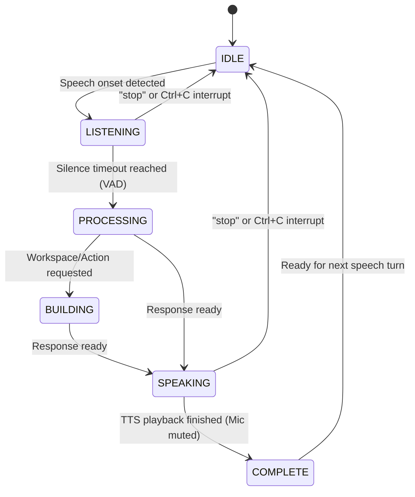
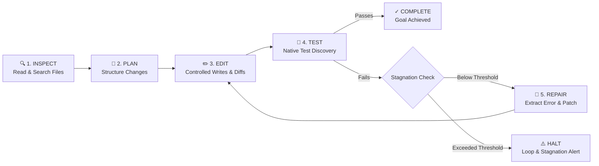

# m.AI.leage

> **Lightweight, local-first Python CLI for local AI execution, workspace intelligence, and telemetry.**  
> *Zero Cloud • 100% Local • Ollama Powered*

---

## 🌟 Overview

`m.AI.leage` is a modular, local-first developer tool built for modern AI engineering. It connects directly to your local [Ollama](https://ollama.ai) daemon to orchestrate lightweight agents, inspect local codebases, track execution latency and token metrics, and run deep environmental diagnostics.

- **Local-First & Offline**: Zero cloud APIs, telemetry leaves no footprint outside `.mileage/`.
- **Modular Architecture**: Clean separation into `core/`, `agents/`, `models/`, `tools/`, `ui/`, and `metrics/`.
- **Automatic Model Discovery**: Seamlessly detects and verifies installed local models from Ollama.
- **Deep Diagnostics**: `mileage doctor` performs full environmental, runtime, and model health audits.
- **Rich Terminal UX**: Powered by Typer and Rich with graceful, structured error handling and cross-platform formatting.

---

## 🏛️ Architecture

```mermaid
graph TD
    CLI[mileage CLI (Typer)] --> UI[ui/ (Rich Panels, Tables, Doctor View)]
    CLI --> Core[core/ (Config, Workspace, Logger, Exceptions)]
    CLI --> Agents[agents/ (LocalAgent, BaseAgent)]
    CLI --> Models[models/ (OllamaClient, Schemas)]
    CLI --> Metrics[metrics/ (MetricsTracker, JSONL Storage)]

    Agents --> Models
    Agents --> Tools[tools/ (FileTools, WorkspaceOverview)]
    Agents --> Metrics

    Core --> WorkspaceFiles[Local Workspace (.mileage/)]
    Models --> OllamaDaemon[(Local Ollama Daemon http://127.0.0.1:11434)]
```

### Module Breakdown

| Directory | Purpose |
|---|---|
| [`core/`](file:///c:/Dhanvi/HACKATHONS/hacktoberfest_reacthyd/src/mileage/core) | Configuration schemas (Pydantic), workspace lifecycle, file scanning, structured logging, and typed exceptions. |
| [`models/`](file:///c:/Dhanvi/HACKATHONS/hacktoberfest_reacthyd/src/mileage/models) | Pydantic data schemas and local Ollama client (`check_health`, `list_models`, `verify_installed_models`, `stream_chat`). |
| [`agents/`](file:///c:/Dhanvi/HACKATHONS/hacktoberfest_reacthyd/src/mileage/agents) | Local-first agent implementations orchestrating local Ollama execution with workspace context. |
| [`tools/`](file:///c:/Dhanvi/HACKATHONS/hacktoberfest_reacthyd/src/mileage/tools) | Extensible local tools (`read_file`, `list_files`, `workspace_overview`). |
| [`voice/`](file:///c:/Dhanvi/HACKATHONS/hacktoberfest_reacthyd/src/mileage/voice) | Hands-free local voice assistant: local faster-whisper STT, offline pyttsx3 TTS, VAD silence detector, mic mute during speech, and state machine. |
| [`router/`](file:///c:/Dhanvi/HACKATHONS/hacktoberfest_reacthyd/src/mileage/router) | Intelligent model router: model discovery, capability registry, SQLite telemetry storage, deterministic scoring, standardized local benchmarks, and fallback routing. |
| [`ui/`](file:///c:/Dhanvi/HACKATHONS/hacktoberfest_reacthyd/src/mileage/ui) | Rich console singleton, customized theme, interactive tables, ActionPlan card renderer, and `mileage doctor` renderer. |
| [`metrics/`](file:///c:/Dhanvi/HACKATHONS/hacktoberfest_reacthyd/src/mileage/metrics) | Local JSONL telemetry logging, latency tracking, and token aggregation. |

---

## 🚀 Installation & Setup

### Prerequisites
- Python 3.11 or Python 3.12
- [Ollama](https://ollama.ai) installed locally

### Install Editable Package
```bash
# Clone and install in virtual environment
pip install -e .
```

---

## 💻 CLI Commands

### 1. Doctor Diagnostics
Run an environmental and service audit checking Python version, workspace initialization, Ollama connectivity, verified models, and metrics storage:
```bash
mileage doctor
```

### 2. Initialize a Workspace
Initialize a `.mileage/` metadata directory in the current project, automatically discovering installed Ollama models:
```bash
mileage init --name my-project
```

### 3. Check Workspace Status
Quickly inspect project status, active Ollama model, and execution statistics:
```bash
mileage status
```

### 4. Inspect Local Models
List all verified models currently installed in your local Ollama daemon:
```bash
mileage models
```

### 5. Workspace Intelligence & Token Footprint
Scan workspace files, calculate size, breakdown file types, and estimate token context:
```bash
mileage workspace
mileage workspace --scan
```

### 6. Run Local Agent Query
Query a local model with injected workspace context and real-time streaming:
```bash
mileage run "Explain the architecture of this workspace"
```

### 7. Structured Planning via Gemma (`mileage plan`)
Generate structured, typed `ActionPlan` schemas from text prompts, source code files, or screenshot images without mutating files:
```bash
mileage plan "Refactor authentication module into a separate package"
mileage plan "Fix type errors" --file src/mileage/core/config.py
mileage plan "Convert wireframe to HTML/CSS" --image assets/ui_wireframe.png
```

### 8. Deterministic Model Router (`mileage route`)
Automatically match tasks to the best, fastest, and cheapest local model using deterministic heuristic scoring:
```bash
# Route by explicit task category
mileage route code_generation
mileage route reasoning
mileage route image_analysis

# Auto-infer task category from prompt
mileage route --prompt "Write a quicksort implementation in Python"
```

### 9. Standardized Local Model Benchmarking (`mileage benchmark`)
Run standardized local benchmarks across coding, reasoning, JSON extraction, and recall tasks, storing latency and accuracy metrics in SQLite (`.mileage/router.db`):
```bash
mileage benchmark
mileage benchmark --model gemma3:4b
```

### 10. View Local Telemetry
View local run counts, prompt tokens, completion tokens, and average latency:
```bash
mileage metrics
```

### 11. Hands-Free Voice Interaction
Launch interactive hands-free voice control powered by local Whisper STT, VAD silence detection, and local TTS:
```bash
mileage voice
mileage voice --whisper-model tiny.en --tts
mileage voice --no-tts  # text-only voice transcription
```

#### Voice State Machine


- **Acoustic Isolation**: Microphone capture is muted during the `SPEAKING` state with a cooldown delay to prevent audio feedback and self-listening.
- **Silence & VAD Detection**: Combines WebRTC VAD and adaptive RMS energy analysis to detect natural pauses when the user finishes speaking.
- **Short Spoken Responses**: Answers are compressed into single, event-driven sentences for rapid voice playback.
- **Interruptible**: Saying *"stop"*, *"cancel"*, *"halt"*, or pressing `Ctrl+C` halts speech and processing immediately.

---

### 12. Autonomous Local Coding Agent (`mileage code`)
An autonomous software engineering loop that solves real tasks by inspecting, planning, writing code, running project-native tests, and self-repairing:
```bash
# Execute coding task with automatic testing and repair loop
mileage code "Fix the divide by zero bug in src/calculator.py and verify with tests"

# Specify custom test command or model
mileage code "Add JWT token validation" --model qwen2.5-coder:7b --max-iterations 8

# Dry run simulation without touching files
mileage code "Refactor database models" --dry-run
```

#### Autonomous Execution Loop


- **Controlled Tools**: Sandboxed file tools (`read_file`, `write_file`, `patch_file`, `search_files`, `find_files`, `execute_command`) restricted strictly to the workspace directory.
- **Explicit Tool Permissions**: Arbitrary and destructive shell execution is strictly blocked. Only approved project commands (e.g. `pytest`, `npm test`, `cargo test`, `go test`) are permitted. Shell chaining (`&&`, `;`, `|`) is blocked.
- **Automatic Native Test Discovery**: Discovers and runs pytest, unittest, npm test, cargo test, or go test suites automatically and parses passed/failed counts and failure tracebacks.
- **Stagnation & Loop Detector**: Halts execution when loop thresholds are breached:
  - *Repeated Errors*: Identical test failure repeated 3 times.
  - *Unchanged Edits*: 2 consecutive edits producing 0-byte file changes.
  - *Excessive Retries*: Reached maximum iteration budget (default: 10).
  - *Stalled Execution*: 3 iterations without file modifications while tests fail.
  - *Oscillation*: Cycle detected reverting files back and forth between previous states.
- **Full Telemetry & Session Logging**: Every tool call, model, latency, prompt tokens, and completion tokens are recorded in `.mileage/sessions/<id>.json` and `.mileage/metrics.jsonl`.
- **Concise Terminal Output**: Real-time step badges and summary cards in the terminal while full traces and model payloads remain in `.mileage/logs/`.

## ⚙️ Configuration

Workspace settings are stored locally in `.mileage/config.json`:

```json
{
  "version": "0.1.0",
  "ollama": {
    "host": "http://127.0.0.1:11434",
    "default_model": "llama3.2:latest",
    "fallback_model": "llama3:latest",
    "timeout_seconds": 30.0,
    "temperature": 0.7
  },
  "workspace": {
    "project_name": "my-project",
    "mileage_dir": ".mileage",
    "ignore_patterns": [".git", ".mileage", "node_modules", "__pycache__", ".venv"]
  },
  "logging": {
    "level": "INFO",
    "structured_json": false,
    "log_to_file": true
  },
  "metrics": {
    "enabled": true,
    "metrics_filename": "metrics.jsonl"
  }
}
```

---

## 🧪 Testing

Run the full test suite with pytest:
```bash
pytest -v
# 121 passed across cli, code_cli, coding_agent, config, controlled_tools, metrics, ollama, planner, project_tester, router, stagnation, tools, voice, workspace
```

